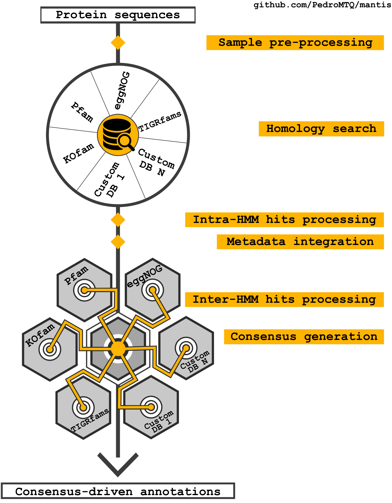
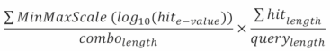
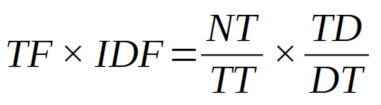

# Mantis - flexible and consensus-driven genome annotation


This tool can be used for protein function annotation, it is a standalone tool that uses HMMER to match sequences against multiple reference datasets, producing a consensus annotation using text mining. It accepts as input one or multiple aminoacids sequence fasta.  
The main goals of this tool are to:
- consider multiple protein domains
- annotate with taxonomy resolution
- use different reference datasets and provide a consensus annotation
- be easy to setup and/or customize
- scale well with multiple samples and/or metagenomes


If you have only loose reads, you need to assemble them first; when you have assembled reads/genomes you need to predict the protein coding regions (gene prediction - e.g. prodigal) to convert your data into a protein fasta that Mantis can then use.

**Mantis is compatible with genomes and metagenomes.**


- [Requirements](#requirements)
- [Quick configuration](#quick-configuration)
- [Functions](#functions)
- [Further details](#further-details)


### Paper
Paper data is available [here](https://github.com/PedroMTQ/mantis/wiki/Resources/mantis_data.7z).
The pre-print is available [here](https://www.biorxiv.org/content/10.1101/2020.11.02.360933v1).
Peer-reviewed paper will be published at a later date.


# Workflow overview




# Straight to the point
### Requirements

- **Python**, tested with v3.7.3 but anything above v3 should be fine
- **requests**, tested with v2.22.0
- **numpy**, tested with v1.18.1
- **nltk**, tested with v3.4.4
- **sqlite**, tested with v3.30.1
- **psutil**, tested with 5.6.7
- **HMMER**, tested with v3.2.1


### Quick configuration

### Quick configuration
1. `git clone git@github.com:PedroMTQ/mantis.git`  
2. Go to cloned mantis folder and run `conda env create -f mantis_env.yml`
3. Run `conda activate mantis_env`
4. Go up one folder and run `python mantis setup_databases`
5. Run `python mantis run_mantis -t target_faa`

The step 1. is essential for the correct download of `NOG_sql.tar.gz` in the Resources folder. An alternative to lfs is to manually download the file and place it in the mantis/Resources folder.


**Custom hmms**  

        custom_hmms_folder=/path/to/mantis/hmm/custom_hmms/   
        custom_hmm=/path/to/HMM_folder/file.hmm

Custom hmms can be added in **MANTIS.config** by adding their absolute path, alternatively you may add them to the **custom_hmms** folder.
Mantis will read the folders within the custom hmms folder and use the .hmm stored in each of those folders.  
For the custom metadata to be regognized please place the custom metadata in the same folder as the custom hmm file and use the same name but with a `.tsv` extension, for example: `path/to/custom_hmm/custom.hmm` and `path/to/custom_hmm/custom.tsv`  
The metadata tsv files should have the following format:

| HMM_profile  | Metadata_type_1 | Metadata_type_2 | Metadata_type_3 |
| :-------------: | :-------------: | :-------------: | :-------------: |
| HMM_1  | 2.1.15.64  |  | this is a description  |
| HMM_1  | 3.2.9.13  | KO0002  | this is a description  |


### Functions

**1. Help**  
````
python  mantis/  -h
````
**2. Setup databases**  
````
python  mantis/  setup_databases
````

**3. Check installation**  
````
python  mantis/  check_installation
````
**4. Merge HMM folder**  
````
python  mantis/  merge_hmm_folder -t target
````
**5. Annotate one sample**  
````
python mantis/ run_mantis -t target.faa -o output_folder -od organism_details -et evalue_threshold -ar acceptable_range -ov overlap_value -mc custom_MANTIS.config    
````
*example*: `python mantis run_mantis -t mantis/tests/test_sample.faa -thmm mantis/tests/test_hmm/test.hmm -od "Escherichia coli"`

**6. Annotate multiple samples**  
````
python mantis/ run_mantis -t target.tsv -o output_folder -et evalue_threshold -ar acceptable_range -ov overlap_value -mc custom_MANTIS.config
````
*example*: `python mantis run_mantis -t mantis/tests/test_file.tsv -thmm mantis/tests/test_hmm/test.hmm`

### Output files  

There are 3 output files:
 - `output_annotation.tsv`, which has all hits and their coordinates and e-values;
 - `interpreted_annotation.tsv` which has all hits, their coordinates and e-value, as well as the respective hit metadata;
- `consensus_annotation.tsv` which has all hits and their respective metadata from the best hmm sources consensus.  

The first two files can have the same query sequence in several lines (query sequence/hmm source) while the `consensus_annotation.tsv` will only have one line per query sequence (consensus/query).

# Further details

1. [Requirements](#1-requirements)
2. [Installation](#2-installation)
3. [Configuration](#3-configuration)  
   *  [Conda environment](#31-conda-environment)
   *  [Setting your own paths](#32-setting-your-own-paths)
   *  [Custom HMMs](#33-custom-hmms)
   *  [Setting HMMs weight](#34-setting-hmms-weight)
4. [Functionalities](#4-functionalities)  
   4.1 [Setup databases](#41-setup-databases)  
   4.2 [Check installation](#42-check-installation)  
   4.3 [Merge HMM folder](#43-merge-hmm-folder)  
   4.4 [Annotating one sample](#44-annotate-one-sample)  
   4.5 [Annotating multiple samples](#45-annotate-multiple-samples)  
   4.5 [Annotating Metagenomes](#46-annotating-metagenomes)  
5. [Examples](#5-examples)  
   5.1 [Example annotate one sample](#51-example-annotate-one-sample)  
   5.2 [Example annotate multiple samples](#52-example-annotate-multiple-samples)  
6. [Output](#6-output)  
   6.1 [Mantis output](#61-mantis-output)  
   6.2 [Other outputs](#62-other-outputs)  
7. [Additional information](#7-additional-information)  
   7.1 [Reference data](#71-reference-data)  
   7.2 [What is the default e-value?](#72-what-is-the-e-value-threshold)  
   7.3 [How are hits generated?](#73-how-are-hits-generated)  
   7.4 [How are hit consensus generated?](#74-how-are-hit-consensus-generated)  
   7.5 [A note on efficiency](#75-notes-on-efficiency)  
8. [Project structure and architecture](#8-project-structure-and-architecture)  
9. [Copyright](#9-copyright)  
10. [References and acknowledgements](#10-references-and-acknowledgements)  


## 1. Requirements

This tool requires a **Conda** environment with the following packages:
- **Python**, tested with v3.7.3 but anything above v3 should be fine
- **requests**, tested with v2.22.0
- **numpy**, tested with v1.18.1
- **nltk**, tested with v3.4.4
- **sqlite**, tested with v3.30.1
- **psutil**, tested with 5.6.7
- [HMMER](#10-references-and-acknowledgements), tested with v3.2.1

**Mantis can only run on Linux-based systems**  


##### How much space do we need?
The lineage annotation requires quite a lot of space since NOG's HMM database is quite extensive. For the taxonomy you will need around 2.8 terabytes. The rest of the HMMs only take up around 200 gibabytes.  
You don't need to use all of this data though! To remove them, see [this](#71-reference-data).


## 2. Installation

Mantis is easy to setup, simply:  

1. Clone the repository with git  
2. Edit MANTIS.config with desired paths
3. Create a Conda environment for Mantis with `conda env create -f mantis/mantis_env.yml`
4. Activate the previously created Conda environment with `conda activate mantis_env`
5. Setup all default databases for Mantis with`python mantis setup_databases`

To check your installation run:
````
python mantis check_installation
````
Keep in mind the installation will take a while as a lot of data is downloaded. If NOG's hmms are not used it can finish within a couple of hours, otherwise it may take a few days.  
To customize your installation (setting installation paths or removing certain HMMs) please refer to [configuration](#32-setting-your-own-paths).


## 3. Configuration
The **MANTIS.config** allows the user to edit and add custom HMMs. An example config file is included, please use the same syntax, otherwise configuration won't be taken into account.

Mantis comes with a MANTIS.config file which serves as the default to all the users in the system. You can configure your own MANTIS.config file by copying this file and editing it as you wish. Afterwards you can just add `-mc <path/to/edited_MANTIS.config>`.  

#### 3.1 Conda environment  

It's preferable to use a self contained environment, avoiding compatibility issues, but you can run Mantis in whichever Conda environment you'd like, simply active it and run Mantis.     

This is not necessary, but if you'd like to share your Mantis environment across multiple users do the following:
1. Create the Mantis environment in a group folder location, by running `conda env create -f mantis_env.yml -p <path/to/group/folder/>`
Future Mantis users now need to do the following:
2. Run `conda config` to generate the `.condarc` file
3. Edit `.condarc` file (usually located in your root folder) and add:
````
envs_dirs:  
    - path/to/group/folder/  
````

#### 3.2 Setting your own paths

After running `setup_databases` you may wish to move data around, if so, make sure you change all these paths:
````
uniprot_folder=/path/to/mantis/Resources/Uniprot/  
go_obo_folder=/path/to/mantis/Resources/Gene_Ontology/  
ncbi_dmp_path_folder=/path/to/mantis/Resources/NCBI/  
default_hmms_folder=/path/to/mantis/hmm/  
NOGT_hmm_folder=/path/to/mantis/hmm/NOGT/    
NOGG_hmm_folder=/path/to/mantis/hmm/NOGG/  
pfam_hmm_folder=/path/to/mantis/hmm/pfam/  
kofam_hmm_folder=/path/to/mantis/hmm/kofam/  
tigrfam_hmm_folder=/path/to/mantis/hmm/tigrfam/  
````
If you don't move any of these folders, don't worry about configuring this.  
If you don't want all the hmm files to be used, you can change the path to 'NA', for example: `NOGT_hmm_folder=NA`

**Important**: All of the default hmms belong to their respective authors, I haven't compiled any of this data, I'm merely distributing it in a more automated manner! Make sure you cite them when using this tool/their data.

`NOGT` is the collection of taxon specific HMMs, `NOGG` the collection of all HMMs.

#### 3.3 Custom hmms
````
custom_hmms_folder=/path/to/mantis/hmm/custom_hmms/  
custom_hmm=/path/to/HMM_folder/file.hmm
````
Custom hmms can be added in **MANTIS.config** by adding their absolute path, alternatively you may add them to the **custom_hmms** folder.
This tool will read the folders within the custom hmms folder and use the .hmm stored in each of those folders.  

**Important:**  
Remember to use HMMER's **hmmpress** on the custom hmms!  
If custom hmms are divided 1 hmm/hmm file make sure you merge them together using the `merge_hmm_folder` function.    
If hmms from the same source are not merged, hits processing won't take into account potential hmm hits overlaps.  

Most metadata is formatted differently, therefore, for custom hmms this tool requires the metadata to be formatted in a specific manner, otherwise only the hmm name will be extracted as "metadata".
To see an example please go to `hmm/custom_hmms/` where you will find two files `custom.hmm` and `custom.tsv`.  
In the `custom.tsv` you can see how the metadata should be formatted.
In the first column there should be the HMM name, in the columns that come after any kind of metadata can be added. To specify the type of metadata simply add the type to the headers of the `.tsv` file. Columns without any headers will be assumed to be a free-text description. Some identifiers will still be searched for in this free text (EC, KO, TCDB, DUF, GO, and COG).
For the custom metadata to be regognized please place the custom metadata in the same folder as the custom hmm file and use the same name but with a `.tsv` extension, for example: `path/to/custom_hmm/custom.hmm` and `path/to/custom_hmm/custom.tsv`.  
The metadata tsv files should have the following format:

| HMM_profile  | Metadata_type_1 | Metadata_type_2 | Metadata_type_3 |
| :-------------: | :-------------: | :-------------: | :-------------: |
| HMM_1  | 2.1.15.64  |  | this is a description  |
| HMM_1  | 3.2.9.13  | KO0002  | this is a description  |


An experienced user can add their linking method to the `MANTIS_Interpreter.py` . You can also post an issue in this repository and I can try to write a linking method for your custom hmm.

#### 3.4 Setting HMMs weight

When generating the consensus, some HMMs can be given more weight, this is important because some HMMs are more specific than others.
By default NOG has the most weight since its HMMs are specific to taxon.  
To configure the weight of an HMM simply change the MANTIS.config file:  
- example: **NOGT**_hmm_folder should be `NOGT_weight=X` where X is the weight of the HMM (0-1)  
- example: custom_hmm=path/to/**customHMM**.hmm should be `customHMM_weight=X` where X is the weight of the HMM (0-1)

In essence make sure the  names of the weights correspond to the path of the HMMs.  
If no weight is given to the HMM, it will default to **0.7**.


## 4. Functionalities

To run this pipeline don't call the py files (**calling the code from inside the folder won't work**) instead call on the project folder, like so:
````
python  mantis/  "function"
````
Documentation is also available via console:
````
python  mantis/  -h
````
### 4.1 Setup databases:
````
python  mantis/  setup_databases

Optional arguments: --force_download / -f
                    --chunk_size / -cs
````
This method will download and unzip all the default data into their respective path folders. Please don't move any of this data around during execution!  
This execution mode takes into account the existing data it has downloaded and generated, if for some reason you'd like to download all the data again, use  `-f` or `--force_download` .  
You can use `-cs` or `--chunk_size` to set the amount of HMM profiles per chunk. By default each HMM chunk will have 5000 profiles, this allows better throughput as it ensures resources saturation.

**Note:** It's usually good practice to check your installation with `python  mantis/  check_installation`, if something has failed you should run `python  mantis/  setup_databases` again.


### 4.2 Check installation:
````
python  mantis/  check_installation
````
This method will check the paths from the **MANTIS.config** and check the installed custom HMMs.

### 4.3 Merge HMM folder:
````
python  mantis/  merge_hmm_folder -t target

Mandatory arguments: --target / -t
````

This method will concatenate all the **.hmms** files in a specified target folder **target**. This is useful when you have downloaded a lot of different HMM profiles from the same data source and they are all split into one HMM/file . This can not only cause issues in storage (due to limits in number of files) but it also reduces efficiency with HMMER due to the lack of proper HMM indexation.

### 4.4 Annotate one sample:
````
python mantis/ run_mantis -t target.faa -o output_folder -od organism_details

Mandatory arguments: --target / -t
Optional arguments:  --output_folder / -o
                     --organism_details / -od
                     --evalue_threshold / -et
                     --acceptable_range / -ar
                     --overlap_value / -ov
                     --target_hmm / -thmm
                     --keep_files / -k
                     --skip_consensus / -sc
                     --mantis_config / -mc
                     --default_workers / -dw
                     --chunk_size / -cs
                     --hmmer_threads / -ht
````


- **target** Mantis will run on the `target` fasta path.  
- **output_folder** If no output folder is provided, data will be saved to the `current_path/target_date_time`.  
- **organism_details** this variable is used for determining which hmms to use during taxonomic specific annotation. It accepts an NCBI ID or an organism name; if a string contains a blank space please include the string within quotes (e.g. "genus species"). Any taxon level can be provided. If none are provided, only the general HMMs are used.   
- **evalue_threshold** see [what is the default e-value?](#72-what-is-the-e-value-threshold)  
- **acceptable_range**  see [how are hits generated?](#73-how-are-hits-generated)  
- **overlap_vlaue** If you would like to allow partial overlap between hits, please use `--overlap_value <overlap_value>` or `-ov <overlap_value>`. Default is 0.1, maximum is 0.3.  
- **target_hmm** If you would like to annotate your sample with only one hmm, please use `--target_hmm <absolute path to hmm>` or `-thmm <absolute path to hmm>`. This is mostly used for testing purposes.  
- **keep_files** use this option to delete extra output files  
- **skip_consensus** use this option to skip the creation of the consensus_annotation.tsv output.  
- **mantis_config** use this option to use a custom MANTIS.config file  
- **default_workers** use this to set the amount of processes that will run HMMER (calculated automatically).This is mostly used for testing purposes. If you set it to 1, Mantis will run HMMER without parallelization.  
- **chunk_size** use this to set the size of the chunks that your sample files will be divided in. 1000 sequences per chunk by default.  
- **hmmer_threads** use this to set the number of threads used by HMMER. 5 by default.


***Example***
````
python mantis run_mantis -t mantis/tests/test_sample.faa -thmm mantis/tests/test_hmm/test.hmm -od "Escherichia coli"
````
### 4.5 Annotate multiple samples:
````
python mantis/ run_mantis -t target.tsv -o output_folder -thmm mantis/tests/test_hmm/test.hmm

Mandatory arguments: --target / -t
Optional arguments:  --output_folder / -o
                     --evalue_threshold / -et
                     --acceptable_range / -ar
                     --overlap_value / -ov
                     --target_hmm / -thmm
                     --keep_files / -k
                     --skip_consensus / -sc
                     --mantis_config / -mc
                     --default_workers / -dw
                     --chunk_size / -cs
                     --hmmer_threads / -ht
````

- **target** Mantis will parse `target` and annotate the respective fasta file paths.  			 
- **output_folder** If no output folder is provided, data will be saved to the `current_path/target_date_time/query_name`.  
- **evalue_threshold** see [what is the default e-value?](#72-what-is-the-e-value-threshold)  
- **acceptable_range**  see [how are hits generated?](#73-how-are-hits-generated)  
- **overlap_vlaue** If you would like to allow partial overlap between hits, please use `--overlap_value <overlap_value>` or `-ov <overlap_value>`. Default is 0.1, maximum is 0.3.  
- **target_hmm** If you would like to annotate your sample with only one hmm, please use `--target_hmm <absolute path to hmm>` or `-thmm <absolute path to hmm>`. This is mostly used for testing purposes.  
- **keep_files** use this option to delete extra output files  
- **skip_consensus** use this option to skip the creation of the consensus_annotation.tsv output.  
- **mantis_config** use this option to use a custom MANTIS.config file  
- **default_workers** use this to set the amount of processes that will run HMMER (calculated automatically).This is mostly used for testing purposes. If you set it to 1, Mantis will run HMMER without parallelization.  
- **chunk_size** use this to set the size of the chunks that your sample files will be divided in. 1000 sequences per chunk by default.  
- **hmmer_threads** use this to set the number of threads used by HMMER. 5 by default.


The `target` tsv file should have the following format:

| Query name  | Absolute sample path | Organism details |
| :-------------: | :-------------: | :-------------: |
| query_name_1  | target_path_1  | 561  |
| query_name_2  | target_path_2  | Proteobacteria  |
| query_name_3  | target_path_3  |   |
| query_name_4  | target_path_4  | Escherichia coli  |

An example file is provided `example_file.tsv`. The query name and the sample path are mandatory, the organism details column is optional.

**Important:** it's better to run this method instead of running multiple instances of Mantis! This is because Mantis can be quite intensive when reading HMM reference datasets, if you have multiple Mantis instances reading the same data, disk performance may be compromised.


### 4.6 Other input formats

Mantis also accepts directory paths or compressed files (`.gz`,`.zip`,`.tar.gz`). Samples will be uncompressed and these uncompressed files will be deleted after execution. Keep in mind that with this method it's not possible to input the taxonomical classification of each sample; for taxa-resolved annotations use the previous input methods.

### 4.7 Annotating metagenomes

Mantis scales well with Metagenomes, since it automatically splits fasta files into evenly sized chunks, ensuring parallelization without the potential idle time you'd get due to iterating over sample sequences or the differently sized HMM profiles references.

## 5. Examples

### 5.1 Example annotate one sample
````
python mantis run_mantis -t mantis/tests/test_sample.faa -thmm mantis/tests/test_hmm/test.hmm -od "Escherichia coli"
````
### 5.2 Example annotate multiple samples
````
python mantis run_mantis -t mantis/tests/test_file.tsv -thmm mantis/tests/test_hmm/test.hmm
````

## 6. Output


### 6.1 Mantis Output

This tool generates 3 tab-separated output files (along with HMMER's default output), the `output_annotation.tsv`,`interpreted_annotation.tsv`, and `consensus_annotation.tsv`:  

The `output_annotation.tsv` will look something like this:  

| Query  | HMM_file | HMM_hit | Query_length | Query_hit_start | Query_hit_end | HMM_hit_start | HMM_hit_end | evalue |
| :-------------: | :-------------: | :-------------: | :-------------: | :-------------: | :-------------: | :-------------: | :-------------: | :-------------: |
| Query_1  | HMM_file_1  | HMM_hit_1  | 154  | 64  | 90  | 85  | 105  | 2.1e-46  |

The `output_annotation.tsv` is not very informative when we need to connect our annotations to metadata, that's why I've included `interpreted_annotation.tsv`.


The `interpreted_annotation.tsv` will look something like this:  

| Query  | HMM_file | HMM_hit | HMM_hit_accession | evalue | Query_length | Query_hit_start | Query_hit_end | HMM_hit_start | HMM_hit_end | I | Links |  |  |
| :-------------: | :-------------: | :-------------: |:-------------: | :-------------: | :------------- | :------------- | :------------- | :------------- | :------------- | :------------- | :------------- | :------------- | :------------- |
| Query_1  | HMM_file_1  | HMM_hit_1  | HMM_hit_accession_1  | 2.1e-46  | 230  | 50  | 80  | 300  | 340  | I|  pfam:link_1  | enzyme_EC:link_1  | description:free_text  |
| Query_1  | HMM_file_2  | HMM_hit_2  | HMM_hit_accession_2  | 3.9e-87  | 230  | 1  | 200  | 100  | 320  | I|  ko:link_1  | enzyme_EC:link_2  | description:free_text  |

See [how are hits generated?](#73-how-are-hits-generated) to understand how Mantis is capable of capturing multiple matches for the same protein sequence within the same reference dataset.
However, some query sequences may have different hits against our HMM sources, it is therefore necessary to find some sort of consensus between the several hits:

The `consensus_annotation.tsv` will look something like this:  

| Query  | HMM_Files | HMM_Hits | Consensus_hits | Total_hits | I | Links |  |  |
| :-------------: | :-------------: | :-------------:| :-------------:| :-------------: | :-------------: | :------------- | :------------- | :------------- |
| Query_1  | HMM_file_1;HMM_file_2  | HMM_hit_1;HMM_hit_2  | 3 | 3 | I|  pfam:link_1  | enzyme_EC:link_2  | description:free_text  |
| Query_2  | HMM_file_3;  | HMM_hit_3  | 4 | 5 | I | ko:link_1  | description:free_text  |  |

The consensus coverage is the amount of hit sources that reached a consensus out of all the hit sources for the current query sequence (if there are 4 hits in the consensus and we had a total of 5 hits, then the consensus coverage is 4/5). If the consensus coverage is quite low, consider also taking a look at the results in the interpreted_annotation.tsv.    
Note how each line now corresponds to a query sequence and how this query sequence can match against different HMM sources, thus having different HMM profile matches.  
The consensus is not a mere agglomerate of all the matches found across the different HMM sources, it is actually a group of hits that form some sort of consensus. Please see [how are hit consensus generated?](#74-how-are-hit-consensus-generated) for more information.


### 6.2 Other outputs

Mantis also generates other output files and folders, these can be viewed to keep track of job's execution or HMMER's output files.
 - domtblout: contains the domtblout files generated by [HMMER](http://eddylab.org/software/hmmer3/3.1b2/Userguide.pdf#page=75)
 - output_hmmer: contains HMMER's console output
 - Mantis.out: contains Mantis's console output


## 7. Additional information

### 7.1 Reference data
Mantis uses several default data sources, to stop using these data sources add `NA` to the default hmm path you'd like to stop using, for example: `NOGT_hmm_folder=NA`  
The default hmm data sources are:   
- Pfam
- KOfam
- TIGRfam
- EGGNOG

It also uses a list of [essential genes](https://raw.githubusercontent.com/MadsAlbertsen/multi-metagenome/master/R.data.generation/essential.hmm) to identify HMM profile matches that correpond to previously identified essential genes.
To identify the taxonomic lineage it uses NCBI's taxonmic lineage found [here](https://ftp.ncbi.nlm.nih.gov/pub/taxonomy/new_taxdump).
Respective citations can be found in [References and Acknowledgements](#10-references-and-acknowledgements)


### 7.2 What is the e-value threshold?

We have found that setting the e-value to 1e-3 produces the best results. While this values gives a bigger list of hits, the most significant hits are still selected.
This can however be set to another value by adding `-et evalue`.
You can set the evalue to dynamically change according to the query sequence length, such that:
- if query sequence length <= 150:      e-value threshold = 1e<sup>-10</sup>
- if query sequence length >= 250:    e-value threshold = 1e<sup>-25</sup>
- else:                   e-value threshold = 1e<sup>-query sequence length/10</sup>

Since fasta files are split into chunks, the e-value needs to be adjusted. This is why, for the same hmm hit, you will see different e-values from HMMER's domtblout to Mantis.

### 7.3 How are hits generated?

Possible combination hits are recursively generated similarly to how all possible combinations would be generated.
Combination of hits are chosen according to 3 different metrics, according to what defines a "good combination":
 - High coverage;  
 - Low e-value;  
 - Low number of hits per combinations - many small sized hits are less significant than a few large sized hits;

This is defined by the following equation:



The left fraction's numerator depicts scaled e-value, the denominator the number of hits.  
The right fraction depicts the coverage (percentage of the query sequence covered by our combination) of the combination of hits.  

**This score ranges from 0 to 1, 1 being the highest.**

##### Why log10?  
The e-values within our threshold are extremely low, making comparisons between the raw e-values meaningless. By using the log10 we reduce the range of this distribution, allowing comparison. This also avoids the precision loss that is inherent to the arithmetic capacities of all computer systems.

##### Why MinxMaxScale?  
Other scaling equations could be applied, but the MinMaxScale transforms our e-values into proportions, which fits well the combination hit score calculation equation used.


The total amount of possible combinations (discarding the empty combination) is 2<sup>N</sup>-1 where N is the amount of hits our query has.
Calculating and evaluating all possible combinations is not computationally feasible:

- 10 hits: 2<sup>10</sup> - 1 = 1023
- 15 hits: 2<sup>15</sup> - 1 = 32767
- 30 hits: 2<sup>30</sup> - 1 = 1073741823

When dealing with queries with a large number of hits, testing (and even generating) all combinations is not feasible.
The adapted algorithm is as follows:
1. Create an initial list of possible combinations - where the combination root is a query hit
2. For each possible combination test possible hits that can be added
3. Can combination be expanded? Go to 2; otherwise go to 4
4. Return possible combinations

Please see the function `add_to_combo` to check code.

However, there are cases when this improved algorithm may not be feasible either (even with Cython):
- Long query sequence
- Low hit coverage
- High number of hits

If the previous algorithm doesn't finish within 1 minute, a lazy algorithm comes into play:
1. Select lowest e-value hit and add it to the combination.
2. Does hit overlap with our combination? If not, add it to combination
3. Are there any hits left? If yes go to 1.

When iterating through the hits, if a hit has the same or a slightly higher e-value but higher coverage, this hit would be considered better than the hit with the lowest e-value; this flexible threshold is defined by the `acceptable_range` variable.
The default value is 0.05 but you can define another value, including 0 to remove this flexibility.

**Important**: keep in mind that the best hits selection only occurs within the same data source HMM (that's why it's important to merge the several HMMs profiles of one data source into one single HMM).  


To see how this works, check `MANTIS_Processor.py`.


### 7.4 How are hit consensus generated?

As previously explained, Mantis can get non-overlapping hits from the same HMM source. However, since Mantis uses a lot of different HMM sources, there might not be a consensus between them.
That is why it is crucial to find a way to find some sort of consensus between the different HMM sources.  
The initial step is to identify the best hits for the current query using the same algorithm employed for finding non-overlapping hits. This guarantees that the consensus has the best possible hits amongst all HMM sources.  
In the next step all the remaining hits are cycled through and the consensus is extended (given that the hit is similar to the consensus).   

To find the consensus a two-fold approach was used:  
- Consensus between identifiers
- Consensus between free-text description

The consensus between identifiers is simply calculated by identifying intersections between the different sources.
On the other hand, the consensus between the free-text uses a more advanced approach. It uses a text mining approach to compare the free-text between sources and identify possible matches.

The natural language processing of the annotations free-text entails several steps:
1. Annotation free text pre-processing:
    - Split annotation into documents
    - Remove identifiers
    - Standardize punctuation
    - Remove digits that are not attached to a token
    - Standardize ion patterns
    - Replace Roman numerals with Arabic numerals
    - Divide document into groups of tokens
    - Unite certain tokens (for example: “3” should be merged with “polymerase 3”)
2. [Part-of-speech tagging](#part-of-speech-tagging)  
    - pos_tag with [universal tagging](https://explosion.ai/blog/part-of-speech-pos-tagger-in-python) (contextual)
    - [Wordnet](https://wordnet.princeton.edu/) tagging (independent)
    - Choose best tag (Wordnet takes priority)
    - Removal of unwanted tags (determiners, pronouns, particles, and conjunctions)
3. [Token scoring](#token-scoring)
    - Try to find synonyms (wordnet lexicon) shared between the 2 compared documents
    - Build Term frequency- Inverse Document Frequency vectors (TF-IDF)
4. [Similarity analysis](#similarity-analysis)
    - Calculate cosine distance between the two scaled vectors
    - Calculate Jaccard distance between the two sets of identifiers
    - If similarity score is above the 0.8 consider, it a match
5. [Consensus construction](#consensus-construction)

##### Part-of-speech tagging

Part-of-speech tagging (POST) is the method of lexically classifying tokens based on their definition and context. In the context of this application, the point is to eliminate tokens that are not relevant to the similarity analysis.  
After pre-processing, tokens are tagged with a custom tagger [SequentialBackOffTagger](https://kite.com/python/docs/nltk.SequentialBackoffTagger) independent of context. This tagger uses [Wordnet’s lexicon](https://wordnet.princeton.edu/) to identify the most common lexical category of any given token.  
Should a token be present in Wordnet’s lexicon, a list of synonyms and their lexical category is generated, for example:  

`[(token,noun),(synonym1,noun) ,(synonym2,verb),(synonym3,adjective),(synonym4,noun)]`

The token is then assigned the most common tag **noun**.  

To adjust this lexicon to biological data, [gene ontology](http://purl.obolibrary.org/obo/go.obo) tokens are also added.  
Untagged tokens are then contextually classified with a [Perceptron tagger](http://wiki.apertium.org/wiki/Perceptron_tagger). The classification obtained from this tagger is not optimal (as a pre-trained classifier is used), however, in the current context this is barely of consequence, as this tagger is merely used as a backup when no other tag is available. Optimally a new model would be trained, but unfortunately this would require heavy time-investment in building a training dataset.  
The tokens tagged as being determiners, pronouns, particles, or conjunctions are removed.

##### Token scoring

In this step, tokens are scored based on the “Term frequency- Inverse Document Frequency” technique. This allows the analysis on which tokens are more relevant to a certain annotation, which in turn allows for the identification of other annotations with the same similarly important tokens.  
TF-IDF measures the importance of a token to a document in a corpus. To summarize:
- TF - Tokens that appear more often in a document should be more important. This is a local (document wide) metric.
- IDF - tokens that appear in too many documents should be less important. This is a global (corpus wide) metric.

TF-IDF is calculated with the following equation:



- NT, times token appears in document
- TT, total amount of tokens in document
- TD, total amount of documents
- DT, total amount of times a certain token appears in a document – frequency table

The corpus used to build this metric were all the 561.911 reviewed proteins from Uniprot (as of 2020/04/14). After pre-processing, each protein annotation is split into tokens, and a token frequency table (DT) is calculated and saved into a file.

The TF-IDF score is then locally scaled (min_max scaling relative to the document) so that we can better understand which tokens are more relevant within the analysed document.


##### Similarity analysis

Finally, we can then compare annotations from different sources, by calculating the [cosine distance](https://en.wikipedia.org/wiki/Cosine_similarity) between each pair of TF-IDF scaled vectors. Should the tokens they contain and their importance within the document be around the same, the annotations are classified as “identical”.
Identifiers within the free-text description are also taken into account, via the [Jaccard distance metric](https://en.wikipedia.org/wiki/Jaccard_index). A simple intersection is not used as more general identifiers might lead to too many false positives.

##### Consensus construction

In this manner we are able to construct groups of hits (from different sources) that match between either via identifiers or free-text descriptions. We then evaluate the quality of each group of consensuses and select the best one, taking into account:  
- Percentage of the sequence covered by the hits in the consensus
- Significance of the hits (e-value) in the consensus
- Significance of the reference datasets
- Number of different reference datasets in the consensus


To see how this works, check `MANTIS_Consensus.py` and `MANTIS_NLP.py`.  


### 7.5 Notes on efficiency

Mantis was built to be highly efficient and scalable, while at the same time not relying on heuristic techniques. There are several factors that can cause execution bottlenecks, some of which can be circumvented.  
What are the efficiency bottlenecks?  
- [Workflow design](#workflow-design) – the workflow used is the main contributor to poor performance, an iterative approach is simple to implement but substantially inferior to a parallelized implementation.
- **Number of cores** - the number of cores influences speed performance the most, speed scales linearly with the number of cores, this depends on the hardware available;
- **Number of processes** - one would expect the ideal number of processes to be the same as the number of cores. Up to a certain point increasing the number of processes leads to speed gains, after around 2-3 times the number of cores there’s no more speed gain, increasing past this point can actually lead to severe efficiency decreases due to the overhead generated.
- [Sample size](#splitting-sample-into-chunks) – a larger search space (more query sequences to compare against reference profiles) translates into a higher runtime. An iterative execution can’t possibly handle metagenomic samples in a high throughput scenario, it is essential to properly scale execution so that we can attain results within a reasonable amount of time.
- [Amount of HMM profiles](#splitting-hmms-into-chunks) – again, a larger search space (more reference profiles to match against query sequences) translate into a higher run time.
- **HMMER threads** - thread generation leads to some overhead; I've found that the sweet spot to be around 5 HMMER threads (master thread + 4).

#### Workflow design

Mantis parallelizes its inner sub-tasks via Python’s multiprocessing module. It achieves this by having a global task queue that continuously releases tasks to workers. During each main task of the annotation workflow, a certain number of workers are recruited which will execute and consume all the tasks within the queue. When a worker has finished its job, it will execute another task from the queue, until there are no more tasks to execute. If the queue is well balanced, minimal idle time (time spent waiting for workers to empty the task queue) can be achieved.

#### Splitting sample into chunks

HMMER performance is determined by several factors, one of which is the length of the query sequence, which can be overcome by splitting samples into smaller chunks, allowing parallelization. It’s important to fine-tune the size of the chunks, splitting into very small chunks ensures saturation, but also generates more overhead (due to process spawning and context switching), splitting into bigger chunks generates less overhead but won't ensure saturation.  
A naive approach but efficient approach to splitting the sample into smaller chunks would be to use a moving window (think of k-mers as an analogy).This means that should a sample with have 3005 query sequences and we are splitting into chunks with 500 sequences, we’d have 6 chunks with 500 sequences and a seventh chunk with 5 sequences; hardly an optimal distribution.  
A better approach would be to evenly distribute sequences across the chunks as well as load balance by sequence length, thus creating more even chunks. This increased complexity is slower and more hardware consuming though.  
An elegant middle ground solution is then to only apply load balancing when dealing with small samples, when uneven chunks would more heavily affect time efficiency. On the other hand, when dealing with big samples (more than 200k query sequences - think metagenomic samples), the uneven chunks (now generated through the moving window approach) are unnoticeable in the sheer volume of chunks that have to annotated. Chunk size is dynamically calculated.


#### Splitting HMMs into chunks

Having a large enough reference dataset is essential for blind protein similarity searches, especially when the purpose is the functional annotation of unknown MAGs. While some sources can be a few hundred MBs, others can be spawn to tens of GBs. This discrepancy would lead to substantially different HMMER runtimes. To overcome this issue, HMMs are split into chunks, allowing large datasets to be searched in parallel instead of iteratively. Since both the chunks and the original file are kept (for posteriority), there is duplication of data.

Sample and HMMs splitting achieve quasi-optimal queue balancing.

#### Downsides of multiprocessing

Multiprocessing sounds amazing on paper, and, for specific cases, it can indeed be a wonderful tool! It does however have some downfalls:
- Higher RAM consumption due to process spawning (normally nothing to be worried about)
- Minor calculation errors due to intermediate roundings. An anecdotal example:
    - when splitting the fasta into chunks: fasta with 20 sequences, hit had an i-evalue of 5.98e-52
    - when splitting the fasta into chunks: fasta with 24 sequences, hit had an i-evalue of 5.7e-52
    - when the fasta was not split: hit had an i-evalue of 5.8 e-52  
- Higher disk memory consumption due to the generation of intermediate files and  splitting HMMs into chunks.

Since these are minor issues, for optimal efficiency, multiprocessing is still widely used within Mantis.


#### Using multiple physical nodes?

Mantis can't run on multiple physical nodes since multiprocessing requires data to be shared between processes. This can't be achieved with the current implementation, but could potentially be introduced with an OpenMPI implementation.

## 8. Project Structure and architecture
This should be of no concern to the end user but this project is divided into several folders and `.py` files:  

- `Images` contains images used in this repository
- `slurm_jobs` contains the execution examples for running Mantis with SLURM
- `hmm` contains some folders with hmm related metadata. It also contains the `custom_hmms` folder
  * `custom_hmms` is an empty folder where the user can store their own HMM profiles (1 folder per data source, custom hmm should be merged together and pressed with `hmmpress`)
- `tests` contains sample files for testing `run_mantis`
- `source` contains the all of MANTIS' code
    * `cysthon_src` contains the Cython code responsible for compiling the hit extraction algorithm. Cython was used to increase efficiency.
    * `__main__.py` is the front of the program, this is how the user can interact with the MANTIS by simply calling on the MANTIS folder  
    * `MANTIS.config` is where the user can setup their custom paths, according to their own environment  
    * `MANTIS.py` contains main front for launching the annotations, it inherits from all other classes
    * `MANTIS_MP.py` contains all the code responsible for multiprocessing
    * `MANTIS_Assembler.py`  has all the methods for setting up paths.
    * `MANTIS_DB.py`  has all the methods for setting up the databases.
    * `MANTIS_Interpreter.py` handles the interpretation of the generated annotations. Most HMMs need to be linked to their respective metadata in order to extract usable information.
    * `MANTIS_Processor.py` handles the processing of HMMER's output. It contains the algorithms for finding the best query hits. [How are hits generated?](#73-how-are-hits-generated)
    * `MANTIS_Consensus.py` handles the generation of query sequences consensus. It inherists from `MANTIS_NLP.py`. It contains the algorithms for finding the best query hits. [How are hits consensus generated?](#74-how-are-hit-consensus-generated)
    * `MANTIS_NLP.py` contains the algorithms responsible for text mining (finding the consensus between the free text within the annotations).
    * `Exceptions.py` contains several custom exceptions
    * `utils.py`  contains small functions that are universal to Mantis  

Several folders are also created when setting up this annotator, they are quite self-explanatory. Please don't move them.


## 9. Copyright

This project is available under the MIT license.

## 10. References and acknowledgements

>1. S. R. Eddy. HMMER: biosequence analysis using profile hidden Markov models. HMMER v.3.2.1 www.hmmer.org
>2. eggNOG 5.0: a hierarchical, functionally and phylogenetically annotated orthology resource based on 5090 organisms and 2502 viruses. Jaime Huerta-Cepas, Damian Szklarczyk, Davide Heller, Ana Hernández-Plaza, Sofia K Forslund, Helen Cook, Daniel R Mende, Ivica Letunic, Thomas Rattei, Lars J Jensen, Christian von Mering, Peer Bork Nucleic Acids Res. 2019 Jan 8; 47(Database issue): D309–D314. https://doi.org/10.1093/nar/gky1085
>3. The Pfam protein families database in 2019: S. El-Gebali, J. Mistry, A. Bateman, S.R. Eddy, A. Luciani, S.C. Potter, M. Qureshi, L.J. Richardson, G.A. Salazar, A. Smart, E.L.L. Sonnhammer, L. Hirsh, L. Paladin, D. Piovesan, S.C.E. Tosatto, R.D. Finn Nucleic Acids Research (2019)  https://doi.org/10.1093/nar/gky995
>4. Haft DH, Loftus BJ, Richardson DL, et al. TIGRFAMs: a protein family resource for the functional identification of proteins. Nucleic Acids Res. 2001;29(1):41–43. https://doi.org/10.1093/nar/29.1.41
>5. Aramaki T., Blanc-Mathieu R., Endo H., Ohkubo K., Kanehisa M., Goto S., Ogata H. KofamKOALA: KEGG ortholog assignment based on profile HMM and adaptive score threshold. Bioinformatics. 2019 Nov 19. pii: btz859. https://doi.org/10.1093/bioinformatics/btz859.
>6. Albertsen, M., Hugenholtz, P., Skarshewski, A. et al. Genome sequences of rare, uncultured bacteria obtained by differential coverage binning of multiple metagenomes. Nat Biotechnol 31, 533–538 (2013). https://doi.org/10.1038/nbt.2579
>7. W. Arndt, "Modifying HMMER3 to Run Efficiently on the Cori Supercomputer Using OpenMP Tasking," 2018 IEEE International Parallel and Distributed Processing Symposium Workshops (IPDPSW), Vancouver, BC, 2018, pp. 239-246. https://doi.org/10.1109/IPDPSW.2018.00048
